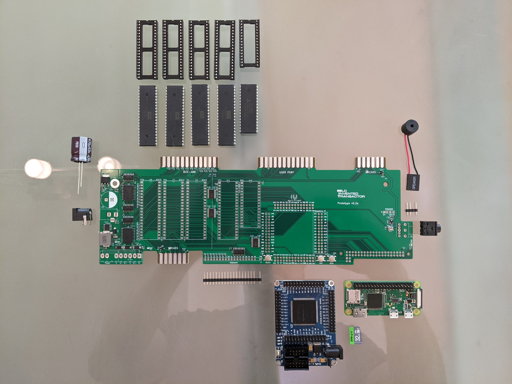

## PET Clone
An open hardware clone of the Commodore PET.  Released to GitHub for the [Commodore Users Europe](http://commodore-users.eu/) June meeting.

## Status
Currently finalizing v0.3 prototype board.  Collaborators warmly appreciated (see [Issues](https://github.com/DLehenbauer/commodore-pet-clone/issues)).
