# PET Universal Board v2
**Original:** [Zimmers.net](http://www.zimmers.net/anonftp/pub/cbm/schematics/computers/pet/univ2/index.html)

## CPU & Memory Expansion
[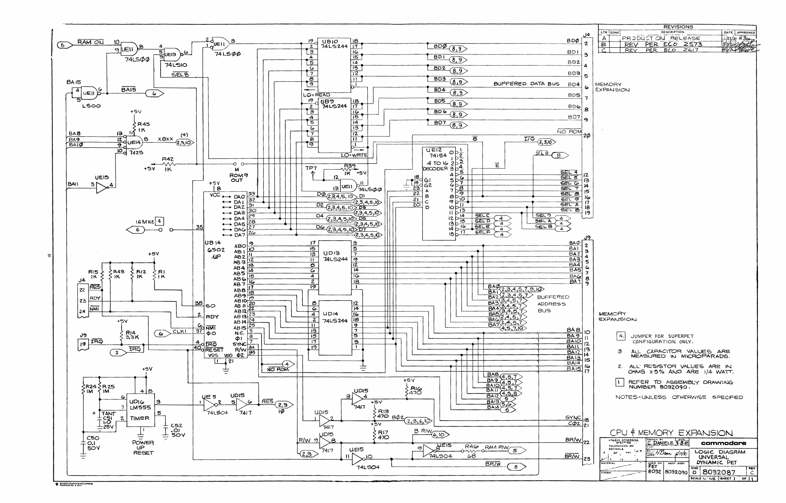](img/8032087-01.png)

## IEEE-488 Interface
[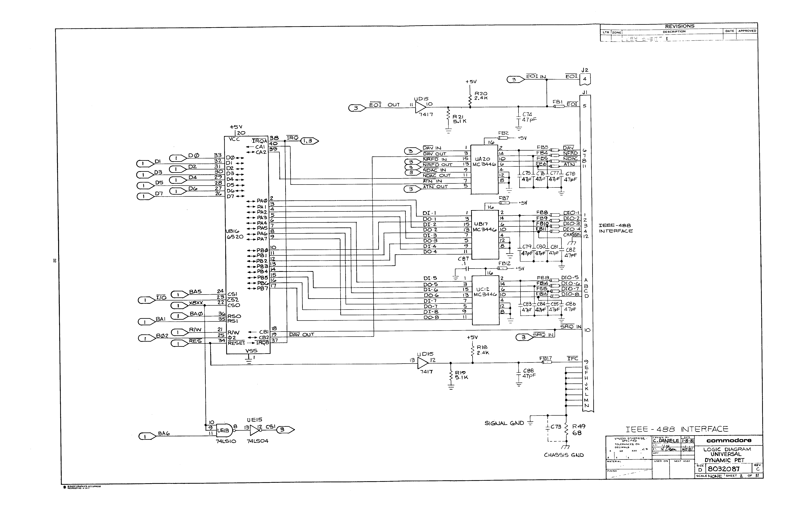](img/8032087-02.png)

## Cassette & Keyboard
[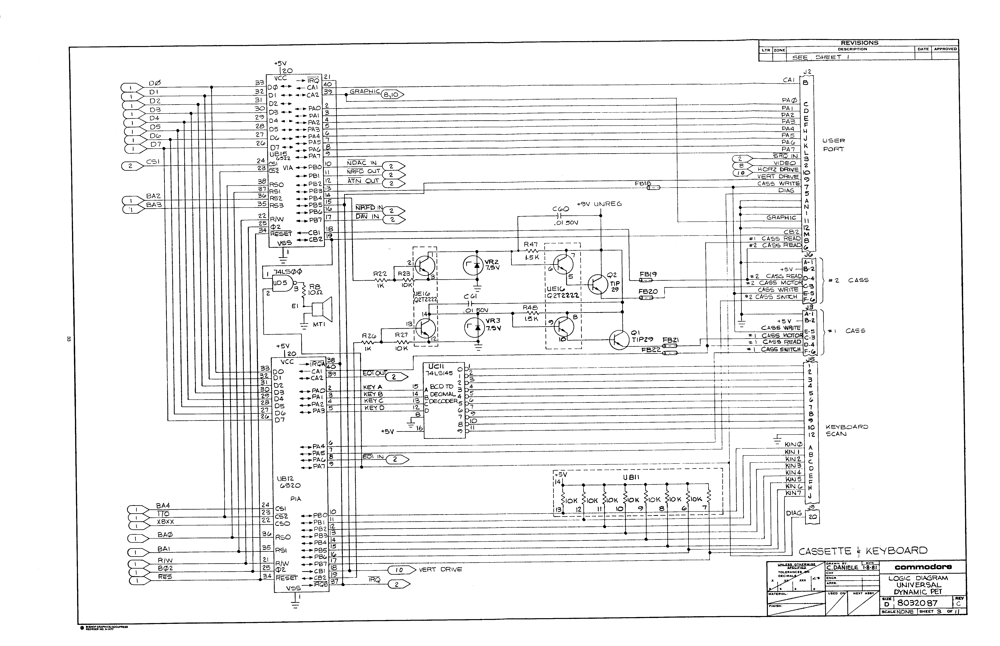](img/8032087-03.png)

## ROMs

## Main RAM
[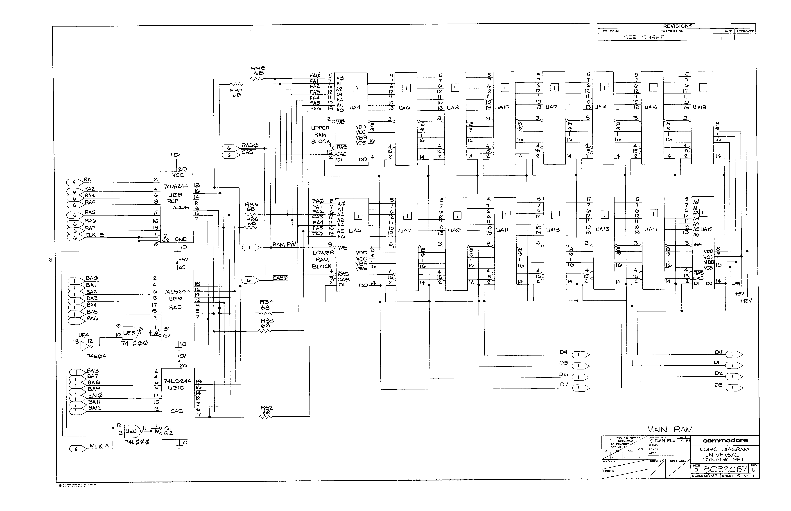](img/8032087-05.png)

## Master Timing
[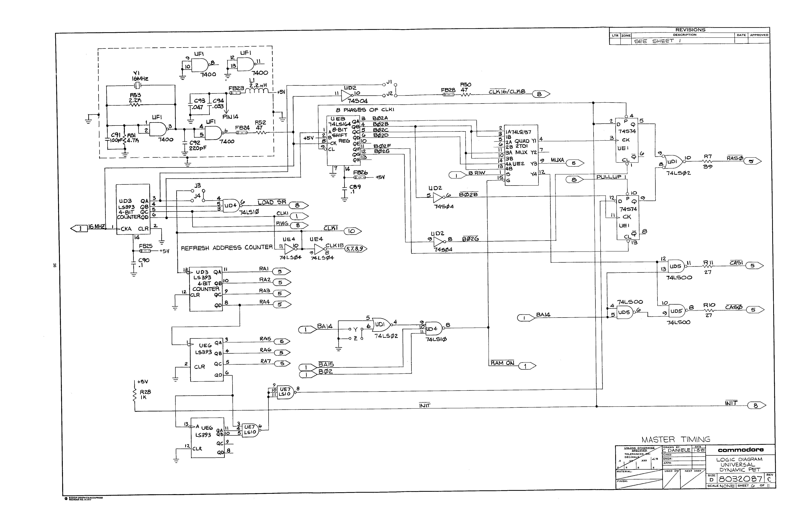](img/8032087-06.png)

## Display Address MUX
[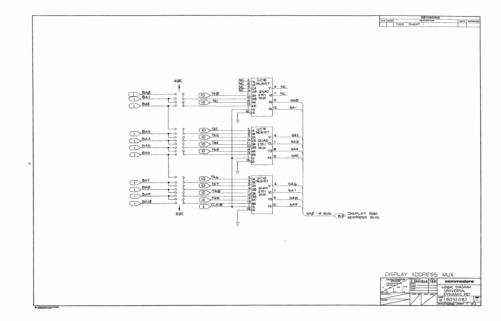](img/8032087-07.png)

## Dot Gen & Even Display RAMs
[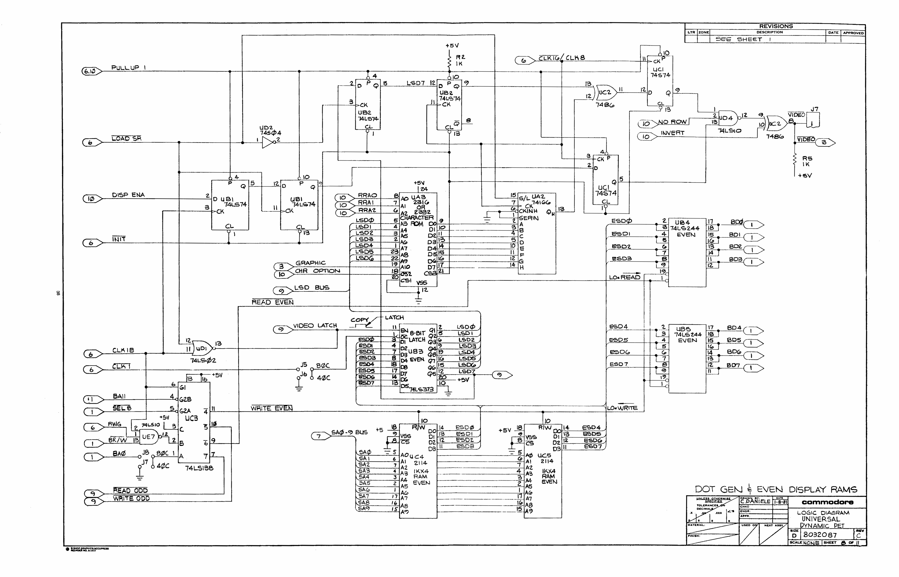](img/8032087-08.png)

## Odd Display RAMs
[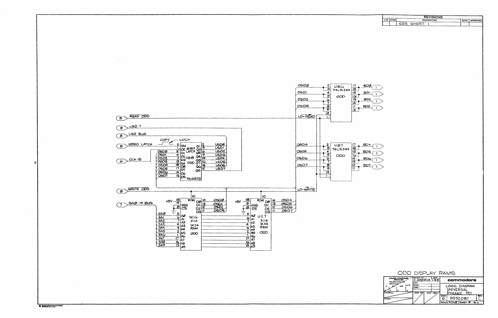](img/8032087-09.png)

## CRTC and Sync Buffers
[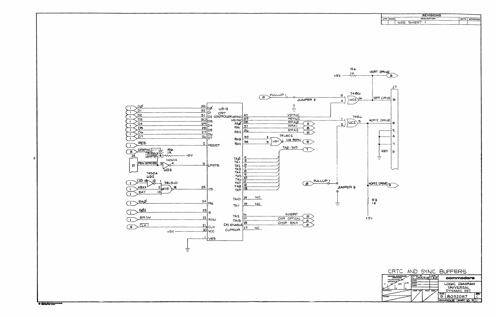](img/8032087-10.png)

## Voltage Regulator
[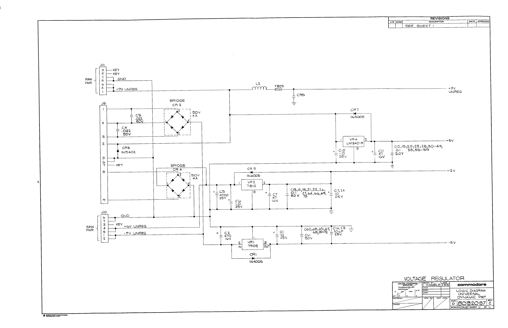](img/8032087-11.png)

## PCB Assembly
[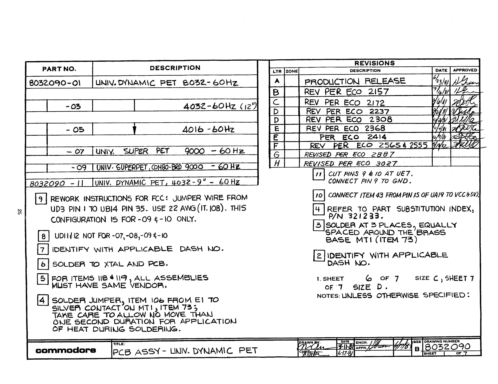](img/8032090-1.png)
[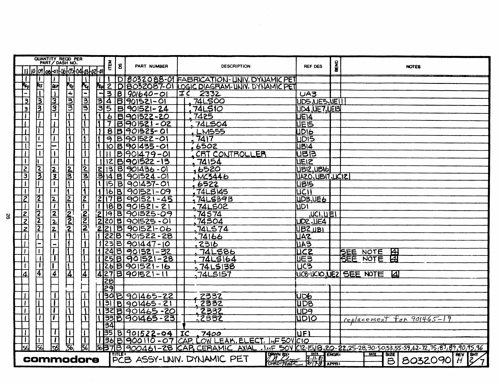](img/8032090-2.png)
[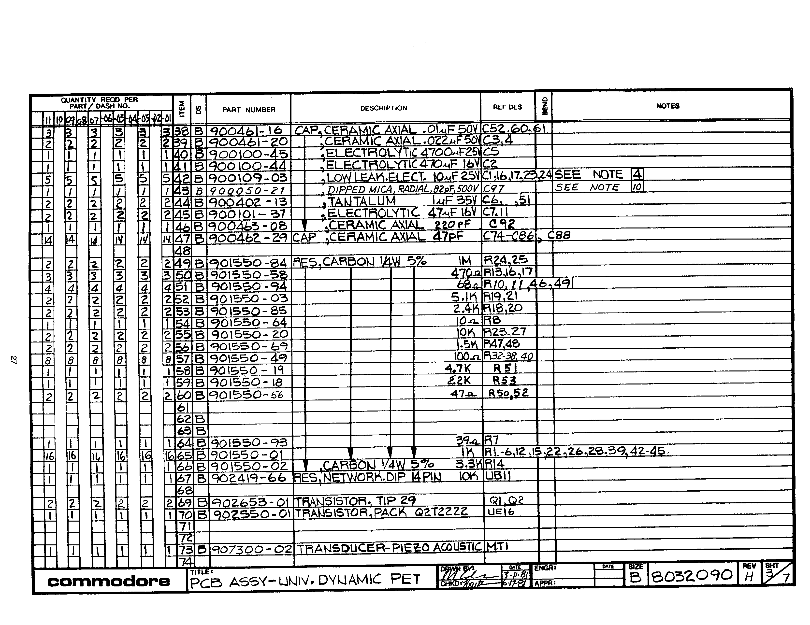](img/8032090-3.png)

[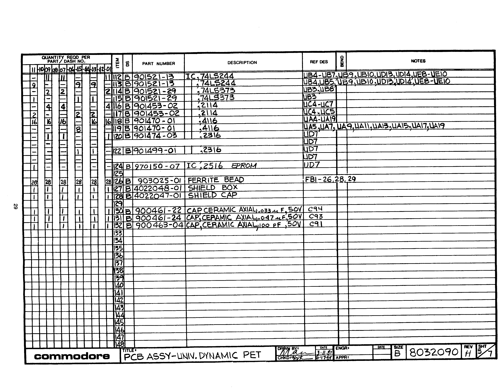](img/8032090-5.png)
[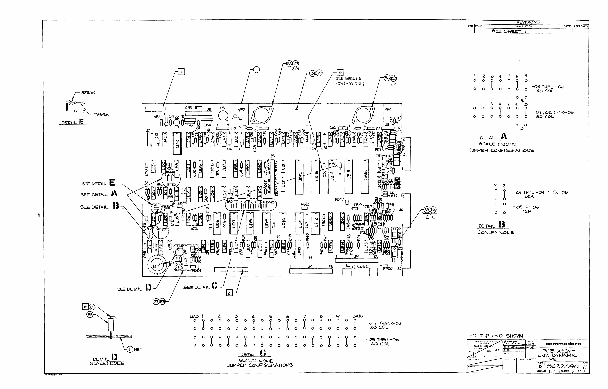](img/8032090-7.png)
